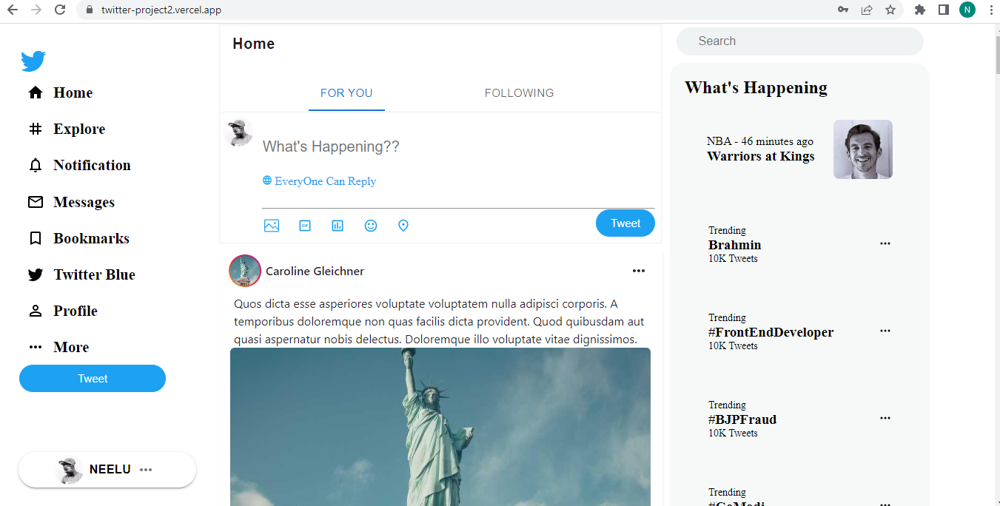

<h1 style='text-align:center;'>Twitter Clone</h1>
This project is a Twitter clone built using React and Material-UI (MUI). It allows users to create accounts, log in, and post tweets. The application stores data locally using LocalStorage and fetches login data from an API.

You can access the deployed version of the application at https://twitter-project2.vercel.app/sign-in.
## Preview

## Features
- User Authentication: Users can create accounts, log in, and log out. Passwords and securely stored in the LocalStorage.

- Following Users: Users can follow other users, and their tweets will appear on the home page. The number of followers and following users is also displayed on user profiles.

- Profile Pages: Each user has their own profile page where their tweets, followers, and following users are displayed. Users can edit their profile information and profile picture.

- Search Functionality: Users can search for other users by their usernames and view their profiles.

- Responsive Design: The application is built using MUI, which provides a responsive design for seamless usage across different devices and screen sizes.

## Deployment
The Twitter clone is deployed using Vercel. You can access the deployed version of the application at https://twitter-project2.vercel.app/sign-in.

## Acknowledgements
Material-UI - React component library for UI design.
React - JavaScript library for building user interfaces.
axios - Promise-based HTTP client for making API requests.
react-router-dom - Routing library for React.